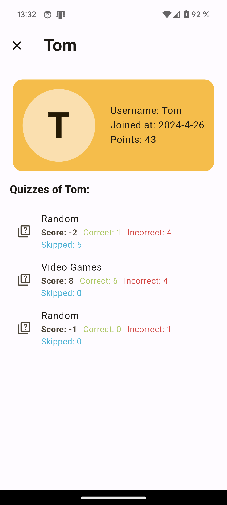

# Quiz App 📝

A fun and interactive quiz app built with Flutter. Test your knowledge on various topics! This project was originally developed for the [Supabase Open Source Hackathon 2024](https://supabase.com/blog/supabase-oss-hackathon), but I couldn't finish it in time.

## Platform Support
Download for Android from the
[releases page](https://github.com/zTomz/supaquiz/releases). You can also run the app in your [browser](https://ztomz.github.io/supaquiz/). Windows release is not available at the time.

## Features

- ✅ Multiple-choice questions
- ✅ Score tracking
- ✅ Timer tracking
- ✅ Leaderboard
- ✅ Randomized questions (over 4,146 questions)
- ✅ A lot of categories
- ✅ Choose between multiple difficulty levels
- ✅ User-friendly interface

## Screenshots


| Screenshot | Screenshot | Screenshot | Screenshot |
| :--------: | :--------: | :--------: | :--------: |
|  |  |  |  |
 |  |  |  |


## Contributing

To run this app on your local machine, follow these steps:

1. **Clone the repository:**

   ```bash
   git clone https://github.com/zTomz/supaquiz.git
   ```

2. **Navigate to the cloned repository:**

   ```bash
   cd supaquiz
   ```

3. **Install dependencies:**

   ```bash
   flutter pub get
   ```

4. **Run the app:**

   ```bash
   flutter run
   ```

## Issues

If you encounter any issues, please [open an issue](https://github.com/zTomz/supaquiz/issues/new/choose) on GitHub.

## License

This project is licensed under the [MIT License](https://github.com/zTomz/supaquiz/blob/main/LICENSE)
